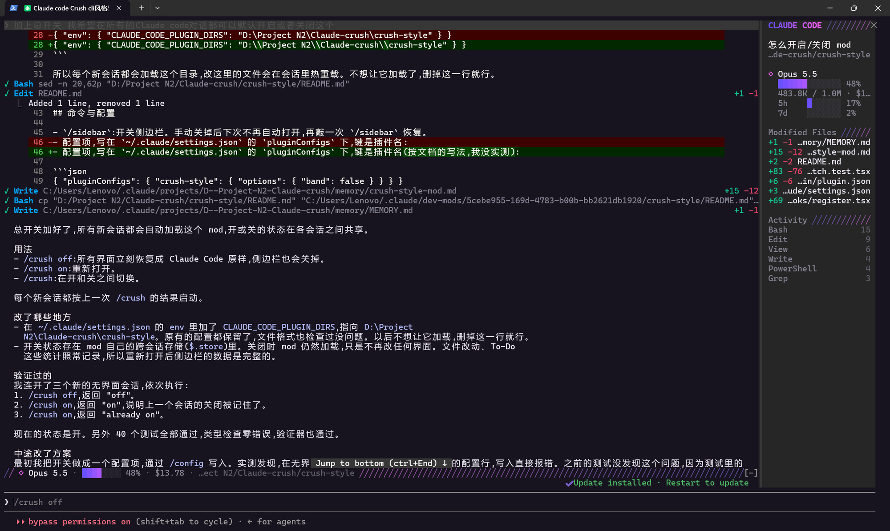

# Claude Crush

**给 Claude Code 换上 [Crush](https://github.com/charmbracelet/crush) 风格的界面。**

这是一个 Claude Code 的 **mod**(插件)。它只改终端里 Claude Code 的样子,换成紫粉配色、带状态图标的工具调用块、渐变闪动的"Thinking…"和一个会话侧边栏。Claude Code 本身一个文件都不用改,不喜欢的话一条命令就能恢复原样。

> 风格灵感来自 Charm 的 Crush,本项目与 Charm 官方无关。

---

## 长什么样



*实际截图(Windows Terminal,全屏模式)。左边是对话区:✓ 标记的工具调用行,Edit 行尾是增删行数。右边是侧边栏:会话标题、模型、上下文用量、额度、改动过的文件、工具调用统计。底部是输入框上方的状态行:模型、上下文用量、花费、当前目录。*

截图里没出现的几种状态,文字示意如下。真实界面里的图标和"Thinking"是紫色到粉色的渐变:

```
▌ 帮我修一下构建脚本

  好的,我先看看 package.json。

✓ View  package.json
✓ Edit  scripts/build.js                                   +3 -1
⣾ Bash  npm run build
  │ > my-app@1.0.0 build
  │ > node scripts/build.js
  ╰ … 12 more lines (ctrl+o to expand)

⣽ Thinking…  12s

◇ Opus 5.5  1m 4s
```

---

## 开始之前

你需要:

1. **已经装好 Claude Code(终端版)。** 在终端里输入下面这行,能看到版本号就说明装好了:
   ```
   claude --version
   ```
2. **版本足够新。** 本项目是在 Claude Code **2.1.287** 上开发和测试的。mod 功能还处在早期阶段,版本太旧可能没有这个功能。升级命令:
   ```
   claude update
   ```
3. **一个能显示真彩色的终端**,推荐 Windows Terminal、iTerm2、WezTerm、Ghostty。Windows 自带的老式 cmd 窗口可能显示不出渐变色。

---

## 安装

两种方法任选一种。**新手推荐方法一**:你只需要复制粘贴一段话,剩下的交给 Claude。

### 方法一:让 Claude Code 自己帮你装(推荐)

1. 打开终端,输入 `claude` 启动 Claude Code。
2. 把下面这一整段复制进去,按回车发送:

   ```
   请帮我安装 Claude Code 的 crush-style mod,按顺序做:
   1. 把 https://github.com/ccckfg/claude-crush 克隆到我的用户主目录下的 claude-crush 文件夹(已经存在的话就 git pull 更新)。
   2. 在 ~/.claude/settings.json 的 env 里设置 CLAUDE_CODE_PLUGIN_DIRS,值是克隆下来的 crush-style 文件夹的绝对路径。文件不存在就新建;保留文件里原有的所有设置;如果 CLAUDE_CODE_PLUGIN_DIRS 已经有值,用系统的路径分隔符(Windows 用分号,macOS 和 Linux 用冒号)把新路径加在后面。改完检查 JSON 格式是否正确。
   3. 运行 claude plugin validate 加上 crush-style 文件夹的路径,确认结果是 Validation passed。
   4. 最后告诉我装在了哪里,并提醒我重启 Claude Code。
   ```

3. Claude 会一步步运行命令、修改设置文件。过程中它会请你确认权限,看清楚后同意即可。
4. 等它说装好了,**退出 Claude Code 再重新打开**,输入 `/crush on`。看到 `Crush style is already on.` 就大功告成 🎉

> 💡 **想要侧边栏停靠在对话旁边?** 装好后再对 Claude 说一句:
> 「把 ~/.claude/settings.json 里的 tui 设成 fullscreen」
> 原因见下文[侧边栏怎么才会出现](#侧边栏怎么才会出现)。

> 第一步克隆需要电脑上装了 git。没有的话 Claude 会告诉你,这时可以改用下面的方法二,直接下载 ZIP。

### 方法二:手动安装(三步)

#### 第 1 步:下载

任选一种:

- **会用 git:**
  ```
  git clone https://github.com/ccckfg/claude-crush.git
  ```
- **不会用 git:** 在本页面右上方点绿色的 **Code** 按钮,选 **Download ZIP**,下载后解压。

然后**记下里面 `crush-style` 文件夹的完整路径**,比如:

- Windows:`D:\tools\claude-crush\crush-style`
- macOS / Linux:`/Users/你的用户名/tools/claude-crush/crush-style`

> ⚠️ 要的是里面那层 `crush-style` 文件夹,不是外面的 `claude-crush`。打开它,应该能看到 `hooks`、`types` 这些文件夹。

#### 第 2 步:让 Claude Code 加载它

**先试一下(只对这一次启动有效):**

```
claude --plugin-dir "D:\tools\claude-crush\crush-style"
```

把引号里的路径换成你自己的。觉得不错,再往下做"每次都加载"。

**每次启动都自动加载:**

打开 Claude Code 的设置文件(没有就新建一个):

- Windows:`C:\Users\你的用户名\.claude\settings.json`
- macOS / Linux:`~/.claude/settings.json`

在最外层的大括号 `{ }` 里加上 `env` 这一段:

```json
{
  "env": {
    "CLAUDE_CODE_PLUGIN_DIRS": "D:\\tools\\claude-crush\\crush-style"
  }
}
```

注意三点:

- **Windows 路径里的每个 `\` 都要写成两个 `\\`**,如上所示。macOS / Linux 的路径照常写。
- 如果文件里**已经有** `"env": { ... }`,就把 `"CLAUDE_CODE_PLUGIN_DIRS": "..."` 这一行加进去,不要再写一个 `env`。
- 文件里原来有别的设置的话,各项之间别忘了用逗号隔开。

> 💡 **偷懒办法:** 直接在 Claude Code 里对 Claude 说:
> 「帮我在 ~/.claude/settings.json 的 env 里加上 CLAUDE_CODE_PLUGIN_DIRS,值是 D:\tools\claude-crush\crush-style」
> 它会帮你改好并检查格式。

#### 第 3 步:重启并确认

退出 Claude Code,再输入 `claude` 重新打开。然后输入:

```
/crush on
```

看到 `Crush style is already on.` 就说明装好了 🎉

如果提示没有这个命令,请看下面的[常见问题](#常见问题)。

---

## 日常使用

| 你想…… | 输入 |
| --- | --- |
| 关掉这个风格,恢复原版界面 | `/crush off` |
| 重新打开 | `/crush on` |
| 在开和关之间切换 | `/crush` |
| 打开或关闭侧边栏 | `/sidebar` |

- **开关会被记住。** 今天关掉,明天打开 Claude Code 也还是关着的,直到你再输入 `/crush on`。
- 关掉以后,界面和原版 Claude Code 完全一样。

### 侧边栏怎么才会出现

侧边栏要在 Claude Code 的**全屏模式**下才能停靠在对话旁边。在 `settings.json` 里加上 `"tui": "fullscreen"` 就能开启全屏模式:

```json
{
  "tui": "fullscreen",
  "env": {
    "CLAUDE_CODE_PLUGIN_DIRS": "D:\\tools\\claude-crush\\crush-style"
  }
}
```

- 终端窗口够宽(**至少 144 列**)时,侧边栏会自动出现。
- 窗口窄一些(**至少 110 列**)时,输入 `/sidebar` 手动打开。
- 不在全屏模式时,`/sidebar` 会在输入框上方展开一块,而不是停在旁边。
- 你手动关掉侧边栏后,它不会再自动出现,输入 `/sidebar` 才会恢复。

### 输入框上方的那一行

没有侧边栏时,输入框上方会显示一行简要信息:模型、上下文用了多少、花了多少钱、To-Do 进度、git 分支和当前目录。

### 输入时的颜色

在输入框里打字时,开头的 `/命令`、`!` 和 `@文件名` 会被染上颜色。

---

## 可选设置

这几个选项写在 `settings.json` 的 `pluginConfigs` 里,不写就用默认值:

```json
{
  "pluginConfigs": {
    "crush-style": {
      "options": {
        "band": false,
        "toolGroups": "fold"
      }
    }
  }
}
```

| 选项 | 默认 | 作用 |
| --- | --- | --- |
| `sidebar` | `true` | 全屏模式下自动打开侧边栏。设为 `false` 就只在你输入 `/sidebar` 时打开 |
| `band` | `true` | 输入框上方那一行信息。设为 `false` 关掉 |
| `toolGroups` | `"expand"` | Claude 连续读很多文件时,每个文件单独一行。设为 `"fold"` 则保留原版的"Read 5 files"合并写法 |
| `spinnerWords` | `"crush"` | 等待时显示 Thinking、Generating 等词。设为 `"claude"` 则保留 Claude Code 原版那些有趣的动词 |

> 如果改了没有生效,把 `"crush-style"` 换成 `"crush-style@inline"` 试试。不同加载方式下,插件在设置里的名字可能不一样。

---

## 常见问题

**输入 `/crush` 提示没有这个命令?**

按顺序检查:

1. 路径是否指向 `crush-style` 文件夹(打开后能看到 `hooks` 文件夹),而不是外层的 `claude-crush`。
2. `settings.json` 的格式是否正确。可以让 Claude 帮你检查:「检查一下我的 ~/.claude/settings.json 格式对不对」。
3. 改完设置后是否**完全退出并重新打开**了 Claude Code。
4. 版本是否太旧:运行 `claude --version`,必要时 `claude update`。
5. 在终端里运行下面这行,看 mod 本身有没有问题(最后应显示 `Validation passed`):
   ```
   claude plugin validate "D:\tools\claude-crush\crush-style"
   ```

**颜色发灰,没有渐变?**

你的终端可能不支持真彩色。换用 Windows Terminal、iTerm2 等现代终端。

**侧边栏一直不出来?**

确认开启了全屏模式(见上文),并且窗口足够宽。也可以直接输入 `/sidebar`。

**会影响 Claude 的回答,或者多花钱吗?**

不会。它只改变终端里**怎么显示**,不改 Claude 读到的内容,也不会额外调用模型。唯一的额外动作是:每轮对话结束后,它会运行一次 `git branch --show-current` 来读取当前分支名,用在侧边栏里。

**在 Claude 桌面版或 VS Code 里有效吗?**

不会改变它们。这个 mod 只改终端界面,其他地方保持原样。

**想彻底卸载?**

删掉 `settings.json` 里 `CLAUDE_CODE_PLUGIN_DIRS` 那一行,重启 Claude Code,再把下载的文件夹删掉即可。

---

## 它能改什么,不能改什么

**能改:** 你的消息、Claude 的回复、工具调用和输出、等待动画、每轮结束的耗时行、命令输出框、侧边栏、输入框上方的信息行、输入时的颜色。

**改不了:** 这些部分 Claude Code 目前不开放给 mod 修改。

- 启动时的 Logo
- 输入框本身的边框
- 权限确认弹窗(出于安全考虑只能由 Claude Code 自己画)
- 整体的颜色主题

---

## 想自己改改?

- **换颜色:** 所有颜色都在 `crush-style/hooks/theme.tsx` 文件最上面。Claude Code 开着的时候改完保存,它会自动重新加载,马上就能看到效果。
- **更多开发细节**(代码结构、测试、实现原理)见 [`crush-style/README.md`](crush-style/README.md)。

---

## 致谢与许可

- 界面风格和配色(Charple、Dolly 等)来自 [Charm](https://charm.sh) 的 [Crush](https://github.com/charmbracelet/crush)。本项目与 Charm 无关。
- 本项目使用 [MIT 许可证](LICENSE)。
